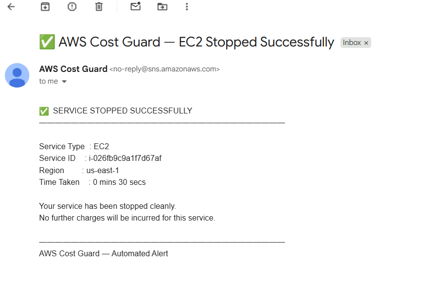
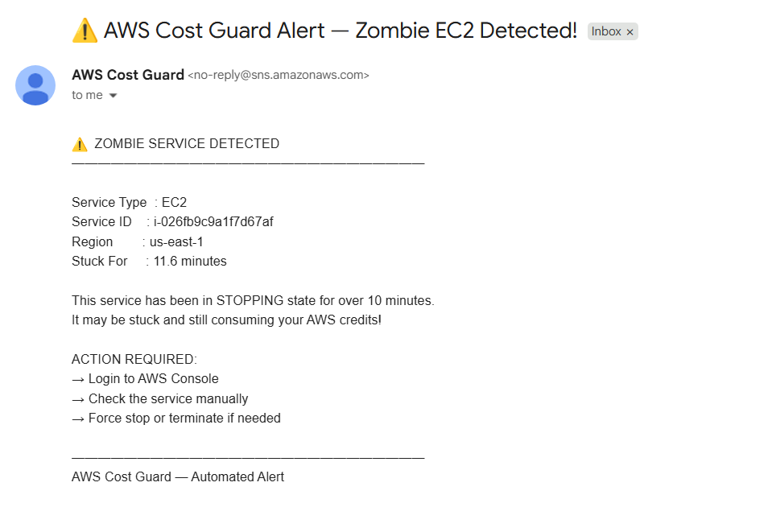
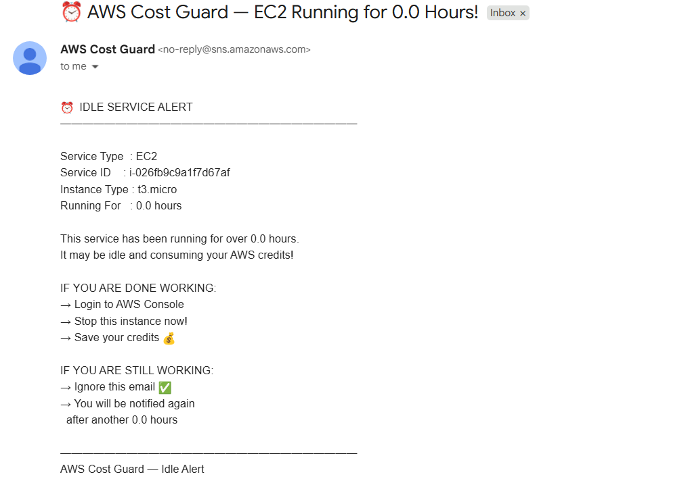
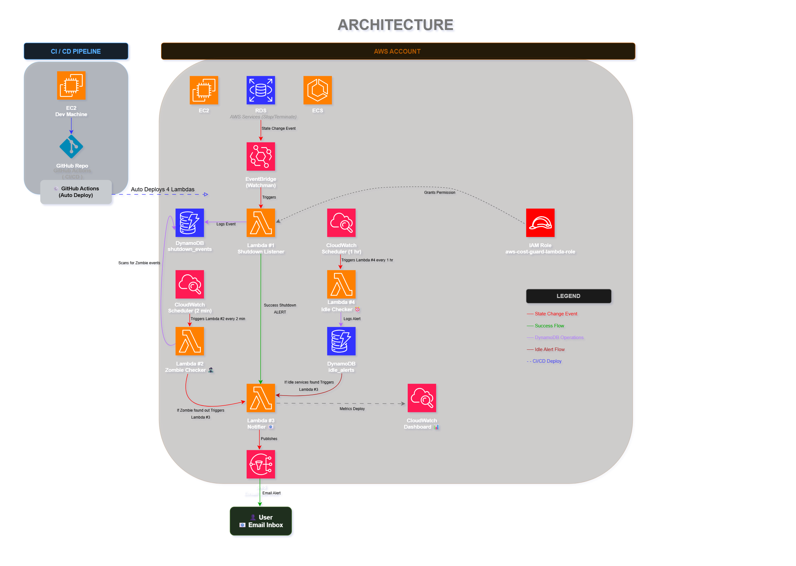

# AWS Cost Guard 🛡️

> A serverless, event-driven AWS monitoring tool that automatically tracks service shutdowns, detects zombie services, alerts idle running instances, and sends real-time email notifications — solving a real AWS credit drain problem.

---

## 📌 Table of Contents
- [Problem Statement](#-problem-statement)
- [Solution](#-solution)
- [Live Demo](#-live-demo)
- [Architecture](#architecture)
- [Workflow Scenarios](#-workflow-scenarios)
- [Features](#-features)
- [Tech Stack](#tech-stack)
- [Setup Instructions](#setup-instructions)
- [CI/CD Pipeline](#-cicd-pipeline)

---

## 🎯 Problem Statement

AWS users — especially students and free tier users — face two common problems:

**Problem 1 — No visibility into shutdowns:**
> When stopping AWS services (EC2, RDS, ECS), each service takes different time to shut down. Users close the console tab assuming the service stopped, but it may still be running — costing credits silently.

**Problem 2 — Forgotten running services:**
> A student starts an EC2 instance for a 2-3 hour project, closes the laptop, and forgets to stop it. The instance runs all night draining free tier credits.

**AWS does not provide any built-in alerting for either of these scenarios.**

---

## 💡 Solution

AWS Cost Guard is a fully serverless monitoring tool that:
- ✅ Automatically detects when any AWS service starts shutting down
- ✅ Tracks how long each service takes to stop
- ✅ Detects **zombie services** stuck in stopping state for >10 minutes
- ✅ Alerts users about **idle running services** after 3 hours
- ✅ Sends real-time email notifications for all events
- ✅ Requires **zero manual intervention** after setup

---

## 🎥 Live Demo

> 📹 **Demo Video**: [Watch on YouTube](#) ← add your link here

### Email Notifications Preview:

**✅ Success Email** — when service stops cleanly:



**⚠️ Zombie Alert** — when service is stuck:



**⏰ Idle Alert** — when service runs too long:



---

## Architecture




## 🔄 Workflow Scenarios

### Scenario 1 — Normal Shutdown ✅
```
Step 1: You stop EC2/RDS in AWS Console

Step 2: EventBridge detects state change instantly
        → Triggers Lambda #1

Step 3: Lambda #1 logs "stopping" in DynamoDB
        shutdown_complete = False
        start_time = 10:28 AM

Step 4: EC2 fully stops
        EventBridge fires again → Lambda #1 triggered
        → Calculates duration = 2 mins 14 secs
        → Updates DynamoDB: shutdown_complete = True
        → Calls Lambda #3

Step 5: Lambda #3 sends success email via SNS

Step 6: You receive email:
        ✅ EC2 stopped successfully in 2 mins 14 secs
```

---

### Scenario 2 — Zombie Detection ⚠️
```
Step 1: You stop RDS in AWS Console

Step 2: EventBridge → Lambda #1 logs "stopping"
        shutdown_complete = False
        start_time = 10:28 AM

Step 3: RDS gets STUCK — never sends "stopped" event
        Lambda #1 never called again
        DynamoDB record stays: shutdown_complete = False

Step 4: CloudWatch Scheduler ticks every 2 minutes
        → Wakes up Lambda #2 (Zombie Checker)
        → Scans DynamoDB for incomplete shutdowns

Step 5: At 10:38 AM Lambda #2 finds:
        start_time = 10:28 AM
        now        = 10:38 AM
        difference = 10 minutes → ZOMBIE! 🧟

Step 6: Lambda #2 updates DynamoDB:
        status = ZOMBIE
        zombie = True  ← prevents future spam alerts

Step 7: Lambda #2 calls Lambda #3
        → Sends zombie alert email

Step 8: You receive email:
        ⚠️ RDS stuck for 10 minutes! Manual action required
```

---

### Scenario 3 — Idle Service Alert ⏰
```
Step 1: You start EC2 for project work at 9:00 AM
        Work for 2-3 hours, close laptop, forget to stop

Step 2: CloudWatch Scheduler runs every 1 hour
        → Wakes up Lambda #4 (Idle Checker)
        → Calls AWS EC2 API: list all running instances

Step 3: Lambda #4 calculates:
        launch_time   = 9:00 AM
        current_time  = 12:00 PM
        hours_running = 3 hours → IDLE ALERT!

Step 4: Checks idle_alerts DynamoDB table
        "Have we already alerted for this instance at 3hr mark?"
        → No → send alert
        → Yes → skip (prevent spam)

Step 5: Lambda #4 saves alert record in DynamoDB
        Calls Lambda #3 → sends idle alert email

Step 6: You receive email:
        ⏰ EC2 running for 3 hours! Stop it to save credits 💰
```

---

## ✨ Features

| Feature | Description |
|---|---|
| 🔍 **Auto Detection** | Monitors ALL AWS services automatically — no manual setup per instance |
| ⚡ **Real-time Tracking** | EventBridge detects state changes in seconds |
| ⏱️ **Duration Tracking** | Records exactly how long each service takes to stop |
| 🧟 **Zombie Detection** | Alerts if service stuck in stopping state for >10 mins |
| ⏰ **Idle Alerts** | Notifies when services run idle for 3+ hours |
| 📧 **Email Notifications** | Beautiful email reports for every event |
| 📊 **CloudWatch Dashboard** | Single pane view of all shutdown activity |
| 🔄 **CI/CD Pipeline** | GitHub Actions auto deploys all Lambdas on every push |
| 💰 **Zero Cost** | Runs entirely on AWS free tier |
| 🛡️ **Spam Prevention** | Smart deduplication prevents repeated alerts |

---

##  Tech Stack

| Service | Purpose |
|---|---|
| **AWS Lambda (Python 3.11)** | 4 serverless functions — core business logic |
| **AWS EventBridge** | Event-driven trigger for service state changes |
| **AWS DynamoDB** | NoSQL storage for shutdown events and idle alerts |
| **AWS SNS** | Email notification delivery |
| **AWS CloudWatch** | Scheduler (2 min + 1 hr) + Dashboard + Logs |
| **AWS IAM** | Role-based access control for all Lambdas |
| **GitHub Actions** | CI/CD — auto deploys all 4 Lambdas on push |

---


---

##  Setup Instructions

### Prerequisites
```
✅ AWS Account (free tier)
✅ GitHub Account
✅ AWS CLI configured
✅ Git installed
```

### Step 1 — Clone Repository
```bash
git clone https://github.com/your-username/aws-cost-guard.git
cd aws-cost-guard
```

### Step 2 — Create IAM Role
```
AWS Console → IAM → Roles → Create Role
Name: aws-cost-guard-lambda-role

Attach policies:
✅ AmazonDynamoDBFullAccess
✅ AmazonSNSFullAccess
✅ CloudWatchLogsFullAccess
✅ AmazonEC2ReadOnlyAccess
✅ AmazonRDSReadOnlyAccess
✅ AWSLambdaRole
```

### Step 3 — Create DynamoDB Tables
```
Table 1:
  Name:           shutdown_events
  Partition key:  service_id (String)
  Sort key:       event_time (String)

Table 2:
  Name:           idle_alerts
  Partition key:  service_id (String)
  Sort key:       hour_mark (String)
```

### Step 4 — Create SNS Topic
```
AWS Console → SNS → Topics → Create Topic
Name: aws-cost-guard-alerts
Type: Standard

Subscribe your email:
Protocol: Email
Endpoint: your-email@gmail.com
→ Confirm subscription in email ✅
```

### Step 5 — Create Lambda Functions
```
Create 4 Lambda functions (Python 3.11):
1. aws-cost-guard-shutdown-listener
2. aws-cost-guard-zombie-checker
3. aws-cost-guard-notifier
4. aws-cost-guard-idle-checker

For each:
  Runtime:          Python 3.11
  Execution role:   aws-cost-guard-lambda-role
```

### Step 6 — Create EventBridge Rule
```
AWS Console → EventBridge → Rules → Create Rule
Name:   aws-cost-guard-state-change
Type:   Rule with event pattern

Event pattern:
{
  "source": ["aws.ec2", "aws.rds"],
  "detail-type": [
    "EC2 Instance State-change Notification",
    "RDS DB Instance Event"
  ]
}

Target: aws-cost-guard-shutdown-listener
```

### Step 7 — Create CloudWatch Schedules
```
Schedule 1 — Zombie Checker:
  Name:   aws-cost-guard-zombie-schedule
  Rate:   every 2 minutes
  Target: aws-cost-guard-zombie-checker

Schedule 2 — Idle Checker:
  Name:   aws-cost-guard-idle-schedule
  Rate:   every 1 hour
  Target: aws-cost-guard-idle-checker
```

### Step 8 — Add GitHub Secrets
```
GitHub → repo → Settings
→ Secrets and variables → Actions

Add:
  AWS_ACCESS_KEY_ID     → your AWS access key
  AWS_SECRET_ACCESS_KEY → your AWS secret key
```

### Step 9 — Deploy via GitHub Actions
```bash
git push origin main
# GitHub Actions automatically deploys all 4 Lambdas! ✅
```

---

## 🔄 CI/CD Pipeline

Every `git push` to `main` branch:

```
Push code to GitHub
        ↓
GitHub Actions triggers automatically
        ↓
Configures AWS credentials (from secrets)
        ↓
Zips and deploys:
  ✅ Lambda #1 — shutdown-listener
  ✅ Lambda #2 — zombie-checker
  ✅ Lambda #3 — notifier
  ✅ Lambda #4 — idle-checker
        ↓
All 4 Lambdas updated in ~12 seconds ⚡
```

## 👨‍💻 Author

**Shrunkhal Hood**

Built to solve a real AWS pain point faced by students and free tier users 💪

> *"Stop losing credits to forgotten or stuck AWS services"*

---

⭐ If this project helped you, give it a star on GitHub!
